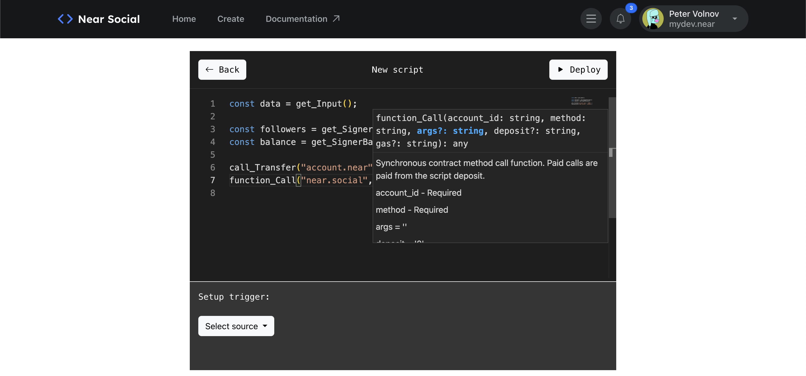
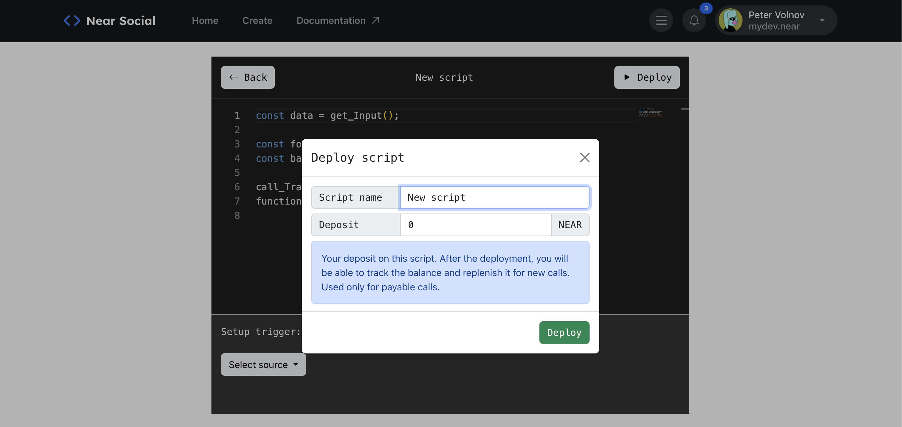
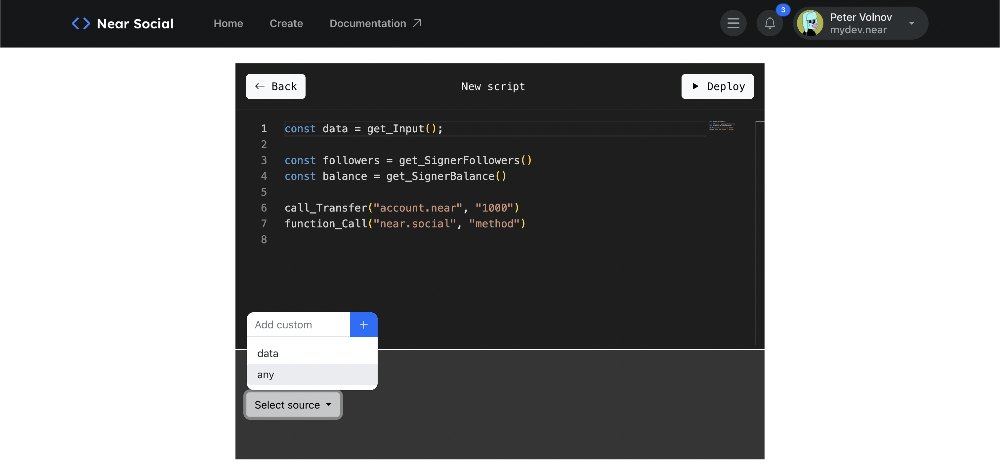
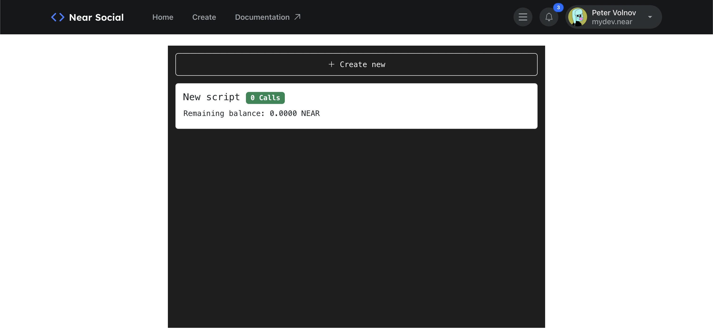

# Callback Editor for NEAR Social

https://near.social/#/azbang.near/widget/CallbackEditor


## Solution for Hackathon

Widget that allows users to write bots in JS that can be triggered when a specific action happens on near.social, such as a new post being created. The bot can perform a designated action in response, such as writing a reply.

Additionally, we have implemented a bot manager that enables users to view all current bots and manage their own. The code for all bots is stored in a single contract, with a function trigger_bot(bot_id: String) that enables one to trigger a bot with the specified id.

Our solution includes several features:
- including a script deployment manager, which displays the number of times a script has been called
- attached deposit amount for each script
- advanced code editor with error diagnostics, autocompletion, and function annotations that can be called on-chain.
- Also implemented some useful methods for scripting
    - `get_Input()`
    - `add_Log()`
    - `get_SignerFollowers()`
    - `get_SignerBalance()`
    - `call_Transfer(account_id, deposit='0')`
    - `function_Call(account_id, method, args = '', deposit='0', gas = '2500000000000')`

Our solution also includes a declarative UI that allows users to configure the trigger that will invoke the on-contract code. Users can update the code and trigger and set a deposit for paid contract calls.

## How to use

1. Open Widget https://near.social/#/azbang.near/widget/CallbackEditor
2. Create Script
3. Create script using editor



4. Publish script and depost. When called, the script can only use the balance that has been credited to it



5. Specify the calling conditions - this is the path that is checked in each call to the `set` method in near.social. If the path is found in the data then the script will be called

```json
{
  "data": {
    "mydev.near": {
      "graph": {
        "follow": {
          "mob.near": ""
        }
      },
      "index": {
        "graph": "{\"key\":\"follow\",\"value\":{\"type\":\"follow\",\"accountId\":\"mob.near\"}}",
        "notify": "{\"key\":\"mob.near\",\"value\":{\"type\":\"follow\"}}"
      }
    }
  }
}
```

**conditions:** `["data", "any", "graph", "follow", "any"]`



6. Go back to see a list of all the scripts

